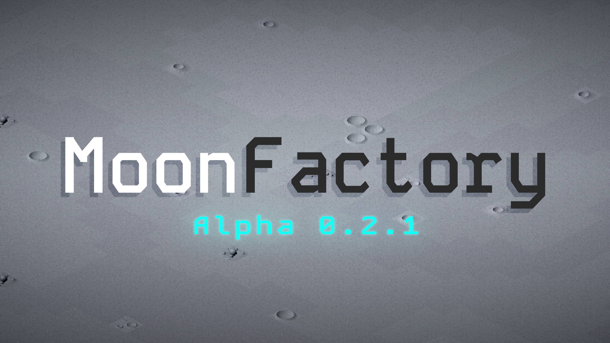

# MoonFactory

Take the role of a lunar satellite operator, and command an army of lunar rovers to construct a factory on the moon. Analyse research samples, unlock advanced machinery, construct your factory, and launch resources back to Earth to reignite industry and save civilisation as we know it!

---

### Controls
WASD -> Move Camera \
Mouse Scroll -> Zoom Camera
Left Click -> Select \
Right Click -> Cancel \
R -> Rotate \
Q -> Open/Close Build Menu \
X (With build menu open) -> Bulldoze \ Delete Ghost

DEBUG:
The debug dropdown at the top will display stats and show additional debug controls\
Spawn Benchmark -> Spawns a set of DebugOutputs, conveyors, and hoppers for rovers to access \
Spawn Rover -> Spawns a debug rover
Instant Build -> Instantly build ghosts upon placement & instantly bulldoze.

### Tips
To play a development build select the latest release on the right, download the ZIP, unpack it and launch the .exe (Windows only).

Open the debug menu, press Spawn Rover, and Spawn Benchmark. Open the build menu, select the conveyor and try placing some ghosts in the world. Conveyors will connect at right angles upon being built. The rover will collect the resources it needs from the benchmark and navigate to the ghosts, building them upon arrival. Right click to deselect the conveyor ghost.

Machines, Rovers, Pylons, and Sample Analysers will open interfaces when clicked on. 

Power pylons will connect to machines, solar panels, and other pylons. Pylons form electrical networks that recieve power from panels and provide it to machines. 
